```{r setup, include=FALSE }
knitr::opts_chunk$set(echo = TRUE)
```

## Learning objectives
By the end of Chapter 0, you should be able to:
 
- Identify and describe common study designs
- Classify variables according to their type (e.g., binary)
- Use numerical and graphical tools to summarize data
- Explain features of and calculate probabilities using important probability distributions (Normal, $t$) 

 
## Learning objectives
By the end of Chapter 0, you should be able to:
 
- Define a sampling distribution
- Understand the importance of the Central Limit Theorem for statistical inference
- Construct and interpret confidence intervals
- Formulate null and alternative hypotheses
- Choose, implement, and interpret hypothesis tests
 


## Outline

- Study Design 

- Summarizing Data

- Statistical Inference

# Study Design

## Study Design

**How you collect data impacts what questions you can (cannot) answer, what statistical methods you can (cannot) use, and what conclusions you can (cannot) draw.**

<span style="color:blue">Extreme Example:</span> Suppose I'm interested in understanding public opinion about biostatistics. I randomly select an individual from our class and ask if they like biostatistics.

 
-  What questions can I answer using these data?
-  What statistical methods can I use to analyze these data?
-  What conclusions can I draw using these data?
 
 

## Study Design: language

 A quick reminder about language:
 

-   <span style="color:blue">Exposure</span>: an explanatory variable that may be associated with (or causally related to) the outcome of interest. This is not always an exposure in the colloquial sense, such as someone being "exposed" to a disease!
-   <span style="color:blue">Outcome</span>: the variable we are primarily interested in measuring or predicting

Examples: 

 
-  Vaccination (exposure) and positive COVID test result (outcome)
-  Tutoring (exposure) and final course grade (outcome)
-  Age (exposure) and cancer occurrence (outcome)
 
 

## Experimental vs. Observational Studies

<span style="color:blue">Experimental</span>:  exposure/treatment is **controlled**  by the researcher (e.g., randomly assign people to drug or placebo)
 
-  Randomized controlled trial 
 

  

<span style="color:blue">Observational</span>:  exposure/treatment is **not controlled  by the researcher** (e.g., we look at a group of people and observe  who smokes and who doesn't smoke)
 
-  Cross-sectional study
-  Cohort study
-  Case-control study
 
 
 
 
## Experimental vs. Observational Studies 
In <span style="color:blue">**experimental**</span>  studies, we can talk about <span style="color:blue"> **causation**</span>  . In <span style="color:orange">**observational**</span>  studies we  talk instead about <span style="color:orange"> **association**</span>  (because we worry about  **confounding** ).  


A <span style="color:blue">**confounder**</span>   is a variable that is associated with both the outcome and   the exposure in a way that creates **bias** if we don't account for it in our analysis.  

  

 
- **Example**:  suppose we're interested in the relationship between smoking and lung function in kids. We know that age is causally associated with lung function: as children grow and develop, their lung function improves. If age is also associated with smoking in our sample (e.g., if older kids are more likely to smoke), then age is a confounder.
  

Much more on the topic of confounding to come...  
 
## 
 
<font size = 20> Experiments </font>


## Randomized controlled trial 
Description:
 
-  Take a sample from the population and **randomly assign  individuals to either treatment** (exposed ) or control/placebo (unexposed ), and follow individuals to observe a specific outcome (e.g., death yes/no, disease yes/no, time to death, change in cholesterol level,...)
 
 

## Randomized controlled trial 
Description:
 
-  Take a sample from the population and **randomly assign  individuals to either treatment (*exposed ) or control/placebo (*unexposed ), and follow individuals to observe a specific outcome (e.g., death yes/no, disease yes/no, time to death, change in cholesterol level,  ...)
 
Pros:
 
-  With a large enough sample, no confounding
-  Gold standard for establishing causality
 
 

## Randomized controlled trial 
Description:
 
-  Take a sample from the population and **randomly assign  individuals to either treatment (*exposed ) or control/placebo (*unexposed ), and follow individuals to observe a specific outcome (e.g., death yes/no, disease yes/no, time to death, change in cholesterol level,  ...)
 
Pros:
 
-  With a large enough sample, no confounding
-  Gold standard for establishing causality
 
Cons:
 
-  Often very expensive
-  Not always possible or ethical to randomize individuals
  
-   Cannot randomly assign someone to a specific age, genetic variant, etc.
-   Unethical to randomly assign harmful exposures (e.g., smoking)
  
 
 

 ## Randomized controlled trial 
Examples: 


 
-  [Effect of Vitamin D and Calcium Supplementation on Cancer Incidence in Older Women ](https://jamanetwork.com/journals/jama/article-abstract/2613159)
-  [Daily Functioning and Quality of Life in a Randomized Controlled Trial of Therapeutic Exercise for Subacute Stroke Survivors ](http://stroke.ahajournals.org/content/36/8/1764.short)
 

 
## 
 
<font size = 20> Observational Studies </font>


## Cross-sectional study 
Description:
 
-  Randomly sample individuals, record their exposure and outcome at a **single** time point/interval  (no follow-up)
 
 

## Observational Studies: Cross-sectional study 
Description:
 
-  Randomly sample individuals, record their exposure and outcome at a **single** time point/interval  (no follow-up)
 
Pros:
 
-  Relatively cheap and easy
-  Can study multiple outcomes and exposures
 
 

## Observational Studies: Cross-sectional study 
Description:
 
-  Randomly sample individuals, record their exposure and outcome at a **single** time point/interval  (no follow-up)
 
Pros:
 
-  Relatively cheap and easy
-  Can study multiple outcomes and exposures
 
Cons:
 
-  Inefficient for rare exposure and disease 
-  Time sequence of exposure and outcome (i.e. which came first) is not always clear
-  Potential confounding (so no conclusions about causality)
 
 

## Observational Studies: Cross-sectional study 

Examples:
  

 
-  [Job strain, work place social support, and cardiovascular disease in a random sample of the Swedish working population](http://ajph.aphapublications.org/doi/abs/10.2105/AJPH.78.10.1336) 
-  [Real-world effectiveness of e-cigarettes when used to aid smoking cessation](onlinelibrary.wiley.com/doi/10.1111/add.12623/full) 
 


 

## Observational Studies: Cohort study 
Description:
 
-  Sample people **without** the outcome of interest , record their exposure, then follow  those individuals over time to observe the outcome
-  Can be **prospective**  (sample people in present time, then follow-up) or **restrospective**  (sample people from a database collected in the past, and observe them through their time recorded in the database)
 
 

## Observational Studies: Cohort study 
Description:
 
-  Sample people **without** the outcome of interest , record their exposure, then follow  those individuals over time to observe the outcome
-  Can be **prospective**  (sample people in present time, then follow-up) or **restrospective**  (sample people from a database collected in the past, and observe them through their time recorded in the database)
 
Pros:
 
-  Time sequence is known (exposure came first)
-  Can study multiple outcomes 
 
 

## Observational Studies: Cohort study 
Description:
 
-  Sample people **without** the outcome of interest , record their exposure, then follow  those individuals over time to observe the outcome
-  Can be **prospective**  (sample people in present time, then follow-up) or **restrospective**  (sample people from a database collected in the past, and observe them through their time recorded in the database)
 
Pros:
 
-  Time sequence is known (exposure came first)
-  Can study multiple outcomes 
 
Cons:
 
-  Inefficient for rare outcomes
-  Prospective cohort studies are often expensive and time-consuming to follow people, and there are opportunities for people to drop out
-  Potential confounding (so no conclusions about causality)
 
 

## Observational Studies: Cohort study 

Examples:
  

 
-  [Drinking tea could help stave off cognitive decline](https://www.medicalnewstoday.com/articles/316619.php) 
-  [Birth control pills may protect against some cancers for decades](https://www.medicalnewstoday.com/articles/316565.php) 
 


 

## Observational Studies: Case-control study 
Description:
 
-  Sample individuals **based on the outcome**  (some with, some without), look back in time (usually) for exposure
 
 

## Observational Studies: Case-control study 
Description:
 
-  Sample individuals **based on the outcome**  (some with, some without), look back in time (usually) for exposure


Pros:
 
-  Efficient for rare diseases
-  Cheaper and faster than cohort studies
-  Can study multiple exposures
 
 

## Observational Studies: Case-control study 
Description:
 
-  Sample individuals **based on the outcome**  (some with, some without), look back in time (usually) for exposure


Pros:
 
-  Efficient for rare diseases
-  Cheaper and faster than cohort studies
-  Can study multiple exposures
 
Cons:
 
-  May not know time sequence of disease and exposure
-  Cannot use to estimate relative risk or disease prevalence % more detail here??
-  Potential confounding (so no conclusions about causality)
 
 

 ## Observational Studies: Case-control study
 
Examples:
  

 
-  [Obesity and the risk of myocardial infarction in 27,000 participants from 52 countries](https://www.sciencedirect.com/science/article/pii/S0140673605676635)
-  [Case control study of human papillomavirus and oropharyngeal cancer](http://www.nejm.org/doi/full/10.1056/NEJMoa065497) 
 

 

## Study design: Practice 
You read [this article  (from 2017), interested in the association between androgen deprivation therpy (ADT), a treatment for prostate cancer, and risk of dementia](https://jamanetwork.com/journals/jamaoncology/fullarticle/2569059?resultClick=24).  

From the article: *In this... study, a text-processing method was used to analyze electronic medical record data from... 1994 to 2013. We identified 9455 individuals with prostate cancer who were 18 years or older at diagnosis with data recorded in the electronic health record and follow-up after diagnosis. We tested the effect of ADT on the risk of dementia. 

  

 
-  What kind of study design is this?
-  Why do you think they chose this design? 
<!-- cheap, can't randomly assign ADT -->
-  What are potential limitations of this study design?
 
 

## Study design: Practice 
 
-  What kind of study design is this?
  
 - <span style="color:cyan">Cohort study (retrospective)</span>
  
-  Why do you think they chose this design? % cheap, can't randomly assign ADT
  
 - <span style="color:cyan"> Randomized controlled trials are out of the question, since you can't randomly assign prostate cancer to individuals. This leaves observational studies. Dementia is not particularly rare, and they likely wanted to make statements about relative risks, so case-control studies are out as well. Cross-sectional studies wouldn't necessarily allow the researchers to determine if dementia came before or after ADT. It may also be difficult to ask individuals with dementia about their history with ADT. Cohort studies are cheap (especially retrospective), and also easily allow the researchers to know whether or not ADT came before dementia *and*  how long of a time there was between ADT and dementia, which may be of interest.</span>
  
 
 

## Study design: Practice 
 
-  What are potential limitations of this study design?
  
 - <span style="color:cyan">  Potential confounding: cannot conclude that ADT causes / does not cause dementia </span>
  
 
 

## Study design: Practice 
Suppose you are interested in determining whether or not there is an association between being a vegetarian and owning a pet iguana. *Very few  individuals own iguanas. Which study design would be most appropriate for answering your research question, and why?
 

## Study design: Practice 
Suppose you are interested in determining whether or not there is an association between being a vegetarian and owning a pet iguana. *Very few  individuals own iguanas. Which study design would be most appropriate for answering your research question, and why? 

  

<span style="color:cyan"> Case-control study. Since we are not interested in establishing causality ("being a vegetarian causes you to own an iguana"...), an observational study is appropriate. Since owning an iguana is rare, cohort studies and cross-sectional studies will likely be inefficient. Therefore, a case-control study is most appropriate. </span>

 

##

<font size = 20> Any Questions? </font>
 

# Summarizing data 


## Motivating Dataset 
Throughout this chapter (and the next), we'll be exploring data containing a random sample of 2500 singleton births in King County in 2001. In 1989, Seattle and King County started a program called [First Steps   which provides free pre-natal care to low-income, pregnant individuals.](https://kingcounty.gov/depts/health/child-teen-health/maternity-support-infant-case-management.aspx) 

  

The goal of the program is to improve birth outcomes, including increased birthweights in King County. Low infant birthweight is one of the most important factors affecting neonatal mortality. 

 

## Motivating Dataset 
Variables in the dataset include:

  


 
-  Participation in First Steps (yes/no)
-  Birth parent's age at time of birth (years)
-  Marital status of birth parent (married yes/no)
-  Child's gestational age at birth (weeks)
-  Parity (number of children in family)
-  Smoking during pregnancy (yes/no)
-  Drinking during pregnancy (yes/no)
-  And more!
 

   

*We'll refer to this dataset as the <span style="color:blue">births</span>  dataset.  Available on the Canvas site as <span style="color:blue">births.csv</span>
 

## Types of Variables 
**How you summarize/analyze data often depends on what type of data you've collected. **

  

The first step to summarizing/describing data is making sure you know what kind of data you have!

 

## Types of Variables 

<span style="color:blue">Categorical</span>:  

  

 
-  **Nominal**:  order has no meaning (e.g., country)
-  **Ordinal**:  order may be meaningful (e.g., level of education)
-  **Binary**:  two possible values; nominal or ordinal (e.g., presence of a genetic variant)
 

  

<span style="color:blue">Quantitative</span>:  

  

 
-  **Discrete**:  values are typically integers (e.g., number of people living with HIV)
-  **Continuous**:  values on a continuum (e.g., time)
 

 

## Types of Variables: Activity 

Sometimes determining variable type is complicated! Consider the following scenario:

  

We survey parents and record information on whether or not they have any children. We record each living child's age, and if any of their children have died, we record the child's age of death. Age at death is recorded monthly from age 0 months to 24 months, and yearly after that. 

 

## Types of Variables: Activity 

We survey parents and record information on whether or not they have any children. We record each living child's age, and if any of their children have died, we record the child's age of death. Age at death is recorded monthly from age 0 months to 24 months, and yearly after that. We plot the number of children who died at each age recorded vs. age in months:

  

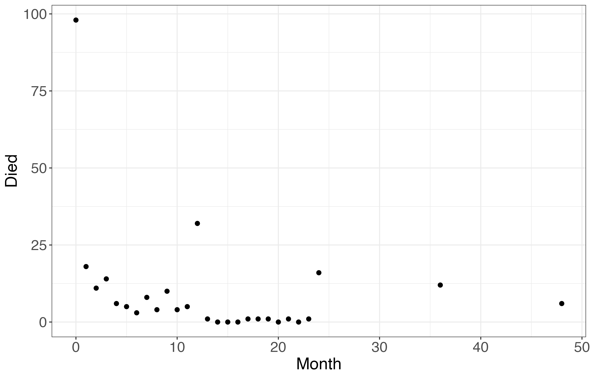
 

## Types of Variables: Activity 
  
 
 
 
  

 
-  Argue why we should consider age at death to be a continuous variable.
-  Argue why we should consider age at death to be a discrete variable.
-  Do you notice anything strange about the plot? Does this affect whether or not we should consider age at death to be continuous or discrete?
 

 

## Types of Variables: Activity 

Argue why we should consider age at death to be a continuous variable.
 
   
 
  
 - <span style="color:blue">Age</span> is inherently continuous. We could, in theory, have ages recorded with an infinite number of decimal points. 
  
 
  
 
   
 
 Argue why we should consider age at death to be a discrete variable.
 
   
 
  
 - <span style="color:blue">Age</span> is collected discretely in the survey. According to the survey, children could not be 2.5 years old, for example.  
  

 

 

## Types of Variables: Activity 

 
Do you notice anything strange about the plot? Does this affect whether or not we should consider age at death to be continuous or discrete?
 
   
 
 
- <span style="color:blue">Death</span> counts seem to be higher at exact years than for the months in between 1-2 years. For 24 months, 3 years, and 4 years, this is likely due to grouping. If a child died between ages 2.5 - 3.5, they would be recorded as having died at 3 years, so this count would be inherently higher since it spans a longer time period than simply 1 month. However, what about 12 months?  
 
   
 
- <span style="color:blue">This phenomenon is known as "age-heaping"</span>, and often occurs in surveys where parents do not know the exact age their child was when they died, or when surveyers themselves record dates inexactly. This is essentially a rounding error, where many deaths are recorded at 1 year even though they may have occurred at any time between 0 and 2 years.  
  
 
 

## Types of Variables: Activity 


Considering age to be continuous *or*  discrete in this example are both justifiable conclusions! In general, we'll consider age to be continuous in this class, but in specific scenarios it may make more sense to consider age in discrete groups. 

 


## Descriptive statistics vs. Inferential statistics 

 Some terms you should know:
 
   
 
  
 -  <span style="color:blue">Descriptive  statistics</span>: summarize or <span style="color:blue">describe</span>  what's happening <span style="color:blue">**in our sample**</span>  
 -  <span style="color:orange">Inferential  statistics</span>: use our data to <span style="color:orange">infer</span>  something about <span style="color:orange">**our population of interest**</span> 
  
 
   
 
 Often when people talk about "doing statistics," they're talking about inferential statistics.
 
   
 
 But statistics is much more than that. In fact, **the most important part of statistics  (and often the hardest) **is translating your scientific question into a statistics question.  Once you've done this, the rest follows.
 
 

## Descriptive Statistics 
Why do we need descriptive statistics?

  

 
-  Making sense of large amounts of data

-  Checking data quality
  
 -  Values outside reasonable range (e.g., height = 9')
 
 -  Implausible combinations of variables (e.g., positive test for cervical cancer for a person without a cervix)
  
-  Observe distribution of variables in dataset
  
 -  Measures of center and spread
  
-  Start to understand direction and strength of association
  
 -  Descriptive statistics and inferential statistics should contribute to the same story
  
 

 

## Descriptive Statistics 
Appropriate descriptive statistics will vary depending on what how many variables you want to describe at once, and whether or not you want numerical or graphical summaries.

  

Outline:
 
-  Univariate
  
    -  Numerical (categorical variables)
    -  Numerical (quantitative variables)
  
-  Stratified/Bivariate
  
    -  Numerical summaries, broken down by group
    -  Graphical
  
 
 

## Univariate Descriptive Statistics: Categorical 
<span style="color:blue">Example</span>:  In our births dataset, we have an indicator variable for whether or not an individual particpated in the First Steps program or not.

  

Suppose we are interested in knowing how many individuals fall into each group. How would we summarize this data?

 

## Univariate Descriptive Statistics: Categorical 

We could begin by counting up the number of individuals that fall in each category:

  


|**First Steps participation**|**Number of Individuals**|
|-----------------------------|-------------------------|
|  Yes                        |                     403 | 
|  No                         |                    2097 |


  

Note that no one in our dataset had a missing value for First Steps participation. If we did have any missing values, we could include this information as an additional "NA" row in our table

 

## Univariate Descriptive Statistics: Categorical 
We can also report the proportion of individuals that fall in each group:

  


  |**First Steps participation**|**Proportion of Individuals (No.)**|   
  |-----------------------------|-----------------------------------|
  |Yes                          | 16.1% (403)                       |
  |No                           | 83.9% (2097)                      |

 

## Univariate Descriptive Statistics: Categorical 
Summary should include:

  

 
-  Number and percent in each group
-  If binary, only need to summarize one group
  
-  The other can be inferred (for example, we had 16.1 % of individuals participate in First Steps, so 100 - 16.1 = 83.9 % did not.)
  
-  Also good to summarize missing data
  
    -  e.g., # and proportion of missing values
  
  
 

## Univariate Desc. Stats.: Quantitative 

<span style="color:blue">Example</span>:  The primary outcome of interest in our births dataset is birthweight, recorded in grams. The data for birthweight:

  


  |**Individual ID**|**Birthweight (grams)**|   
  |-----------------|-----------------------|
  |1 | 3118 |
  |2 | 3466 |
  |3 | 3147|  
  |... | ... | 
  |2498 | 3005  |
  |2499 | 1644  |
  |2500 | 3317|


  

What information may be useful to know?

 

## Univariate Descriptive Statistics: Quantitative 

How many individuals are in our dataset?

 
- [] <span style="color:blue">There are 2500 individuals in our dataset.</span>
 

Do any individuals have missing values for birthweight?

 
- [] <span style="color:blue">No!</span> 
 

Measures of center?

 
-  <span style="color:blue">Mean birthweight is 3414</span> grams. 
-  <span style="color:blue">Median birthweight is 3444 grams.</span>
 

Measures of spread?

 
-  <span style="color:blue">Sample standard deviation is 559 grams.</span>
-  <span style="color:blue">Interquartile range (IQR) is (3096 grams, 3766 grams) (Q1, Q3) </span>
-  <span style="color:blue">Range is (255 grams, 5175 grams)</span> (The smallest baby to ever survive weighed around 212 grams) 
 


 
 
## Univariate Descriptive Statistics: Quantitative 
Summary should include (some of):

  

 
-  Sample size / number of observations
-  Number of missing observations
-  Measures of center:
  
 -  Sample mean
 -  Sample median
  
-  Measures of spread:
  
 -  Sample standard deviation
 -  Interquartile range (IQR): (Q1, Q3) or (Q3 - Q1)
 -  Range: (Min, Max) or (Max - Min)
  
 

 

## Univariate Descriptive Statistics: Graphical 
For categorical variables, we can make barplots:

  

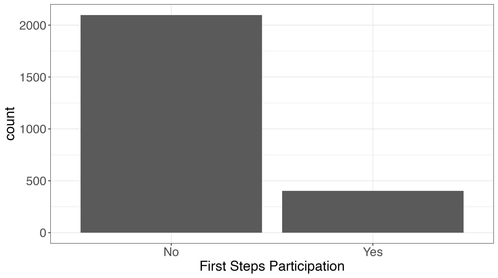

 

## Univariate Descriptive Statistics: Graphical 
For quantitative variables, we can make histograms and boxplots. Histograms are useful for describing the shape of the distribution of a variable, and boxplots are useful for seeing central tendency (and sometimes outliers):

  

 
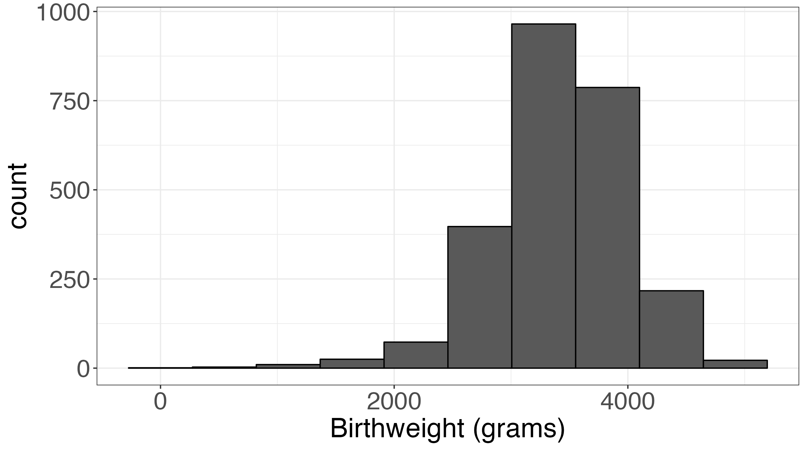
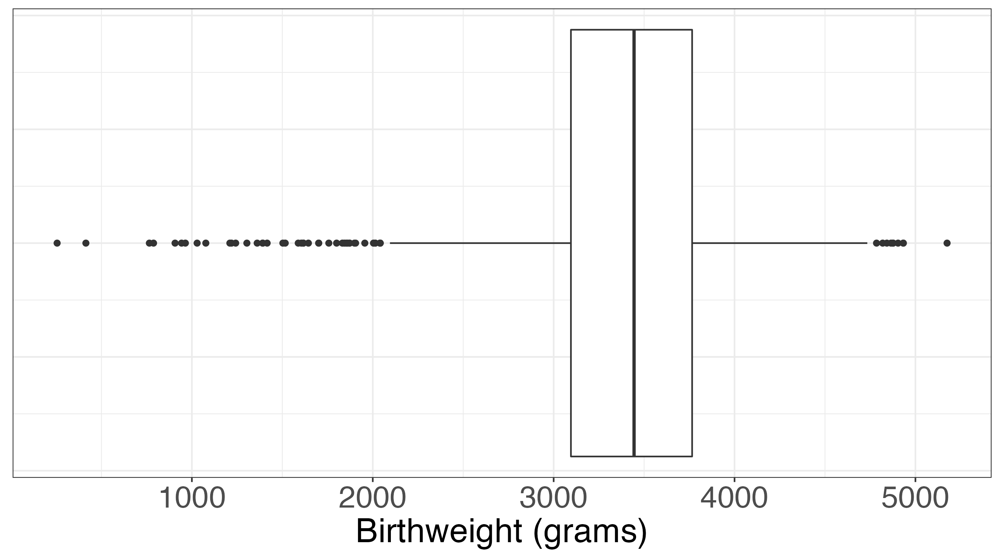
  

 

## Stratified Descriptive Statistics: Graphical 
Sometimes we're interested in the distribution of a variable within certain subgroups, rather than across all the data:

  

 
-  e.g., how does the distribution of birthweights differ between individuals who pariticipated in First Steps and those who did not?
 

  

Stratified descriptive statistics can help us:

  

 
-  Understand the role of the stratification variable
-  Begin to demonstrate the association between the two variables
 

 

## Stratified Descriptive Statistics: Graphical 

How does the distribution of birthweights differ between individuals who participated in First Steps and those who did not? We can make histograms for each category of individuals:

  

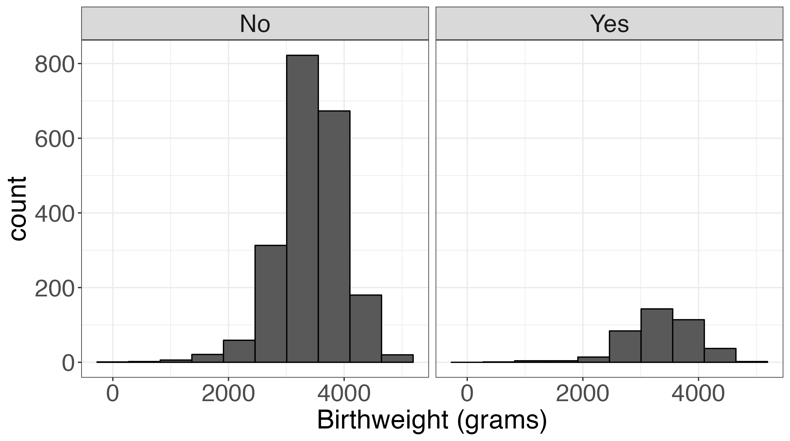

 

## Stratified Descriptive Statistics: Graphical 
We can also use side-by-side boxplots rather than side-by-side histograms. It may be easier to see the median birthweight is slightly lower in individuals who participated in First Steps:

  

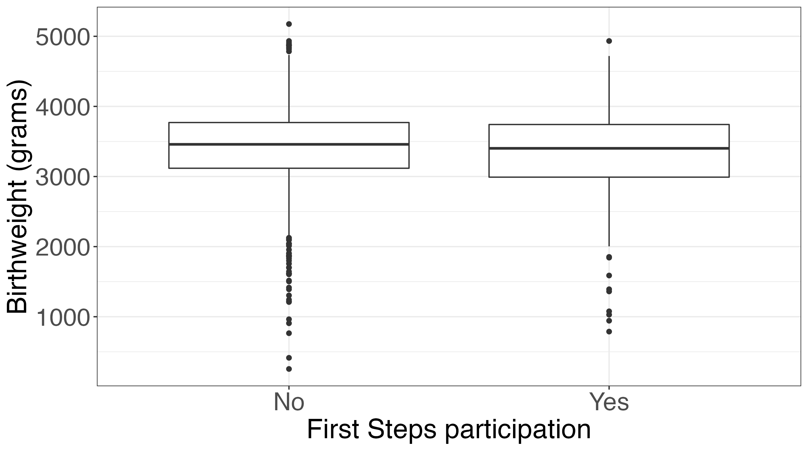
 

## Stratified Descriptive Statistics: Graphical 
Scatterplots are a useful tool for summarizing the relationship between two quantitative variables. Below we plot age in years vs. birthweight in grams for all individuals in our births dataset:

  

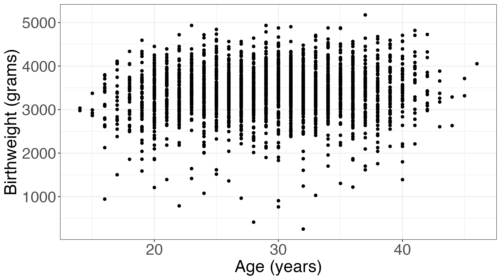

 

## Descriptive Statistics in R 
This is just a small taste of the many possibilities when it comes to tools for summarizing data.

  

We’ll spend more time discussing descriptive statistics in Discussion Section, including how to generate numerical summaries and graphical summaries like these (or better ones!) in \texttt{R .

  

You’ll also get practice on homework assignments and your data analysis project!

 

##

<font size = 20> Any Questions? </font>
 

# Statistical inference 

## Statistical Inference  
Why do we do statistics?

 
-  We can't (usually) measure everyone in our **population 
  
 -  *Example : all pregnant individuals in King County
  
-  Instead, we take a **sample 
  
 -  *Example : 2500 pregnant individuals with singleton births
 -  Note: important to sample well so that the sample truly reflects (is *representative  of) our population of interest
  
-  We hope that what we estimate from the sample also applies to the population
  
 -  The process of translating from the *sample  to the *population  is **statistical inference 
 -  What we estimate in the sample = **estimate  or **statistic 
 -  Corresponding value in population = **parameter 
  
 
 

## Statistical Inference: Work Flow 

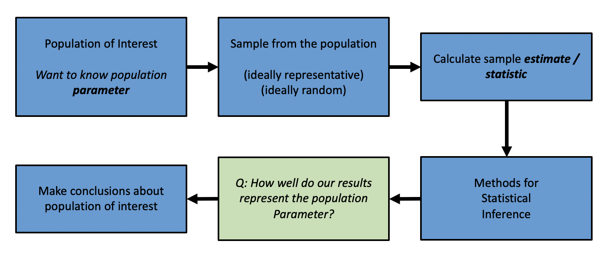
 

## Statistical Inference: Motivating example 

Consider our births dataset. We're interesting in knowing whether the First Steps program improves birth outcomes in King County.

  

 
-  **Scientific question**:  what is the <span style="color:orange">typical</span>   <span style="color:blue">birth outcome</span>  for an individual?

 

 

## Statistical Inference: Motivating example 

Consider our births dataset. We're interesting in knowing whether the First Steps program improves birth outcomes in King County.


 
- **Scientific question**:  what is the <span style="color:orange">typical</span>   <span style="color:blue">birth outcome</span>  for an individual?
-  **Statistical question**:  what is the <span style="color:orange">mean</span>  <span style="color:blue">birth weight</span>  for an individual?
 

 

## Statistical Inference: Motivating example 

Consider our births dataset. We're interesting in knowing whether the First Steps program improves birth outcomes in King County.

  

 
- **Scientific question**:  what is the <span style="color:orange">typical</span>   <span style="color:blue">birth outcome</span>  for an individual?
-  **Statistical question**:  what is the <span style="color:orange">mean</span>  <span style="color:blue">birth weight</span>  for an individual?
-  **Population of interest**:  all babies born in King County
 

 

## Statistical Inference: Motivating example 

Consider our births dataset. We're interesting in knowing whether the First Steps program improves birth outcomes in King County.

  

 
- **Scientific question**:  what is the <span style="color:orange">typical</span>   <span style="color:blue">birth outcome</span>  for an individual?
-  **Statistical question**:  what is the <span style="color:orange">mean</span>  <span style="color:blue">birth weight</span>  for an individual?
-  **Population of interest**:  all babies born in King County
 -  **Parameter**:  population mean
  
 

 

## Statistical Inference: Motivating example 

Consider our births dataset. We're interesting in knowing whether the First Steps program improves birth outcomes in King County.

  

 
- **Scientific question**:  what is the <span style="color:orange">typical</span>   <span style="color:blue">birth outcome</span>  for an individual?
-  **Statistical question**:  what is the <span style="color:orange">mean</span>  <span style="color:blue">birth weight</span>  for an individual?
-  **Population of interest**:  all babies born in King County
 -  **Parameter**:  population mean
-  **Sample**:  2500 singleton births in King County in 2001
 

 

## Statistical Inference: Motivating example 

Consider our births dataset. We're interesting in knowing whether the First Steps program improves birth outcomes in King County.

  

 
- **Scientific question**:  what is the <span style="color:orange">typical</span>   <span style="color:blue">birth outcome</span>  for an individual?
-  **Statistical question**:  what is the <span style="color:orange">mean</span>  <span style="color:blue">birth weight</span>  for an individual?
-  **Population of interest**:  all babies born in King County
 -  **Parameter**:  population mean
-  **Sample**:  2500 singleton births in King County in 2001
  
 -  **Statistic/estimate**:  sample mean (3414 grams)
  
 

 

## Statistical Inference: Motivating example 

Consider our births dataset. We're interesting in knowing whether the First Steps program improves birth outcomes in King County.

  

 - **Scientific question**:  what is the <span style="color:orange">typical</span>   <span style="color:blue">birth outcome</span>  for an individual?
-  **Statistical question**:  what is the <span style="color:orange">mean</span>  <span style="color:blue">birth weight</span>  for an individual?
-  **Population of interest**:  all babies born in King County
 -  **Parameter**:  population mean
-  **Sample**:  2500 singleton births in King County in 2001
  
 -  **Statistic/estimate**:  sample mean (3414 grams)
  


**Next step**:  consider what conclusions can be drawn from our sample estimate about our population parameter. Was our sample representative? Are there implications (statistical, ethical) to generalizing our result to our population?

 

## Precision and Accuracy 
Using descriptive statistics, we can get sample estimates
  
 
-  e.g., the **mean  birthweight for singleton births in King County in 2001 was 3414 grams
 
  
We want to use these sample estimates to infer something about the population 
  

To assess how well these estimates represent the population of interest, we need to know how **accurate  and **precise  they are

  
 
-  Accuracy: are we estimating the right thing?
-  Precision: how variable are our estimates?
 
  
*Just like we want to describe the center and spread of variables when we summarize our data, we also want to understand the center (accuracy) and spread (precision) of our estimates. 
 

## Precision and Accuracy 

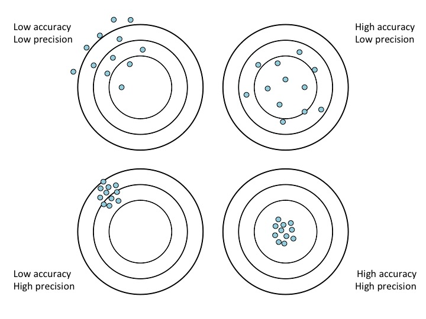
 

## Precision, Accuracy, and Inference 
How do we know how precise or accurate our statistic is?

  

 
-  We need to know how our statistic (estimated from a sample) would vary in *repeated samples 
  
 -  i.e., if we went out and collected another sample from this population, how different would the estimate be? And if we did this a third time, or a fourth time, or...?
  
-  Our statistics are *random : the value you get will change depending on which sample you've ended up with
  
 -  The **distribution  of a random quantity describes how that random quantity behaves
 -  If we know the distribution of our statistic, the center tells us about the (possible${ ^1$) accuracy and the spread tells us about the precision of our statistic
  
 

  

\small ${ ^1$ we only know how accurate our statistic is if we know the population parameter, but we can often judge whether our statistics are very *inaccurate  based on whether our sample is representative of the population or not

 

## Probability distributions 
The <span style="color:blue">distribution  of a random quantity tells you what values that quantity can take and how likely it is to take each of those values.

  
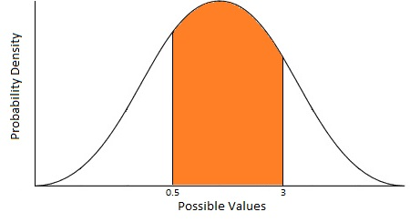
  

<span style="color:blue">Figure:  <span style="color:orange"> Area under curve  = probability that our random quantity takes values between 0.5 and 3

 

## Probability distributions: normal distribution 

  
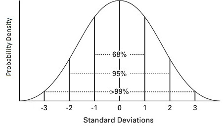
  

<span style="color:blue">Useful property:  if a random quantity is normally distributed $(~N(\mu, \sigma^2))$, then 95 % of the time that quantity will take values within 1.96 standard deviations $(\sigma)$ of its mean $(\mu)$

  

\small <span style="color:blue">Many of the random quantities we care about have a normal distribution!  
 

## Probability distributions: $t$ distribution 
  
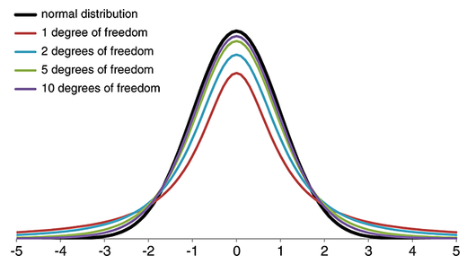
  

The $t$ distribution is similar to a normal distribution, but with heavier tails. How close it is to a normal distribution depends on the *degrees of freedom .

 

## Sampling distributions 

**Sampling distribution : the distribution of an estimate/statistic

  

The <span style="color:orange"> Central Limit Theorem  tells us the sampling distribution of some statistics that we care about *for large samples :

 
-  **Mean:  <span style="color:blue">the sampling distribution of the sample mean is approximately normal:  $\bar{X  \sim N(\mu, \sigma^2 / n)$
  
 -  $\mu$ = population mean
 -  $\sigma^2$ = population variance
 -  $n$ = sample size
  

 
 

## Sampling distributions 

**Sampling distribution : the distribution of an estimate/statistic

  

The <span style="color:orange"> Central Limit Theorem  tells us the sampling distribution of some statistics that we care about *for large samples :

 
-  **Mean:  <span style="color:blue">the sampling distribution of the sample mean is approximately normal:  $\bar{X  \sim N(\mu, \sigma^2 / n)$
  
 -  $\mu$ = population mean
 -  $\sigma^2$ = population variance
 -  $n$ = sample size
  
-  **Proportion:  <span style="color:blue">the sampling distribution of the sample proportion is approximately normal:  $ \hat{p  \sim N(p, p(1-p)/n)$
  
 -  $p$ = population proportion
 -  $n$ = sample size / number of trials
  
 
 

## Sampling distributions 

**Sampling distribution : the distribution of an estimate/statistic

  

The <span style="color:orange"> Central Limit Theorem  tells us the sampling distribution of some statistics that we care about *for large samples :

 
-  **Mean:  <span style="color:blue">the sampling distribution of the sample mean is approximately normal:  $\bar{X  \sim N(\mu, \sigma^2 / n)$
  
 -  $\mu$ = population mean
 -  $\sigma^2$ = population variance
 -  $n$ = sample size
  
-  **Proportion:  <span style="color:blue">the sampling distribution of the sample proportion is approximately normal:  $ \hat{p  \sim N(p, p(1-p)/n)$
  
 -  $p$ = population proportion
 -  $n$ = sample size / number of trials
  
 
Another statistic that we often care about $\frac{\bar{X  - \mu {s  \sim t_{n - 1 $
 
-  $s$ = sample standard deviation
 

 

## Uncertainty: Standard error 
**Sampling distribution : the distribution of an estimate/statistic
**Standard error : the standard deviation of an estimate/statistic

   

Once we know the sampling distribution of our estimate, it's fairly straightforward to figure out how *precise  it is. 

  

<span style="color:blue">Example:  Suppose we have to estimates. The first has sampling distribution $N(2, 5)$ and the second has sampling distribution $N(2, 1)$. *Which of these estimates is more precise? 

  

\small (Hint: precision and variance are inversely related) \pause

  

\normalsize <span style="color:blue">Answer:  We typically describe the precision of an estimate via its standard error. Estimates with *smaller  standard error are *more  precise. Therefore, the estimate with sampling distribution $N(2, 1)$ is more precise.
 

## Uncertainty: Standard error 
**Sampling distribution** : the distribution of an estimate/statistic
**Standard error** : the standard deviation of an estimate/statistic

   

The sampling distribution of the sample mean $\bar{X} $ is approximately normal: $\bar{X } \sim N(\mu, \sigma^2/n)$

  

<span style="color:blue">Question : What is the standard error? 

  

<span style="color:blue">Answer : The standard deviation of the sample mean, which is $\sqrt{\sigma^2}/n $.
 

## Uncertainty: Standard error 
**Sampling distribution** : the distribution of an estimate/statistic
**Standard error** : the standard deviation of an estimate/statistic

   

The sampling distribution of the sample proportion $\hat{p $ is approximately normal: $\hat{p} \sim N(p, p(1-p)/n)$

  

<span style="color:blue">Question : What is the standard error? 

  

<span style="color:blue">Answer : The standard deviation of the sample proportion, which is $\sqrt{p(1-p)}/n $.
 

## Uncertainty: Reporting uncertainty: Motivating example 
Recall our motivating example for statistical inference:

  

We're interesting in knowing whether the First Steps program improves birth outcomes in King County.

  

 
-  **Scientific question**:  what is the <span style="color:orange"> typical   <span style="color:blue">birth outcome  for an individual?
-  **Statistical question**:  what is the <span style="color:orange"> mean  <span style="color:blue">birth weight  for an individual?
-  **Population of interest**:  all babies born in King County
  
 -  **Parameter**:  population mean
  
-  **Sample**:  2500 singleton births in King County in 2001
  
 -  **Statistic/estimate**:  sample mean (3414 grams)
  
 

 

## Reporting uncertainty: Motivating example 
We can convert this outline into general steps for a statistical inference procedure:

  


1.  Start with a **scientific question**:  what is the typical birth outcome for an individual?

2.  Convert to a **statistical question**:  what is the mean birth weight for an individual?

3.  Identify the **population**  (all babies born in King County) and **parameter**  (population mean) of interest
  
4.  Take a **sample**  from the population: 2500 singleton births in King County in 2001

Perform **statistical inference** :
  
6.  Calculate the corresponding **statistic**  (sample mean): 3414 grams
7.  Quantify the **uncertainty** in your statistic
  
8.  **Make conclusions** about your original scientific and statistical questions

 

## Reporting uncertainty: Motivating example 
We can convert this outline into general steps for a statistical inference procedure:

1.  Start with a **scientific question**:  what is the typical birth outcome for an individual?

2.  Convert to a **statistical question**:  what is the mean birth weight for an individual?

3.  Identify the **population**  (all babies born in King County) and **parameter**  (population mean) of interest
  
4.  Take a **sample**  from the population: 2500 singleton births in King County in 2001

Perform **statistical inference** :
  
6.  Calculate the corresponding **statistic**  (sample mean): 3414 grams
7.  Quantify the **uncertainty** in your statistic$\leftarrow$ **two options**  
  
-  Make conclusions about your original scientific and statistical questions
  
 

## Reporting uncertainty: Motivating example 
We've calculated our statistic: average birthweight = 3414 grams

  

Now we need to quantify our uncertainty in this estimate.

  

<span style="color:blue">Option 1</span>:  use the standard error

We estimate that the average birthweight is 3414 grams, with standard error 0.224. 

  

<span style="color:blue">Option 2</span>:  use a 95 % confidence interval (est $\pm 1.96 \times SE$)

We estimate that the average birthweight is 3414 grams. Based on a 95 % confidence interval, this observed average would not be considered unusual if the true average birthweight were between 3413.6 and  3414.5 grams. 

 

## Confidence Intervals 
What does a 95 % confidence interval really mean, and how do we correctly interpret it?

  

The procedure of creating a 95 % confidence interval (est $\pm 1.96 \times SE$) gives us a range of values based on our sample.

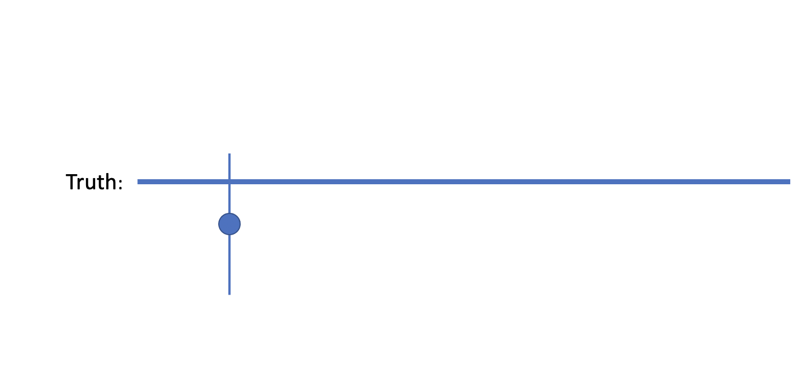 

 

## Confidence Intervals 
What does a 95 % confidence interval really mean, and how do we correctly interpret it?

  

The procedure of creating a 95 % confidence interval (est $\pm 1.96 \times SE$) gives us a range of values based on our sample.

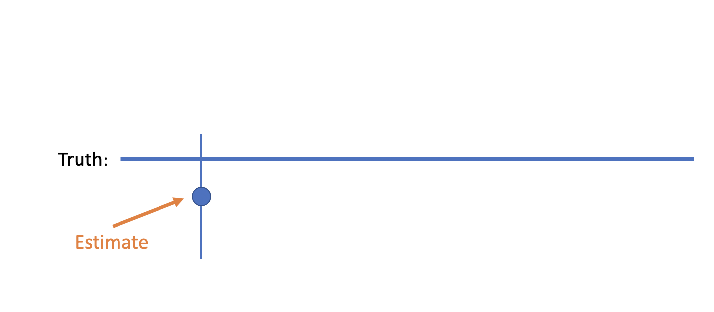 

 

## Confidence Intervals 
What does a 95 % confidence interval really mean, and how do we correctly interpret it?

  

The procedure of creating a 95 % confidence interval (est $\pm 1.96 \times SE$) gives us a range of values based on our sample.

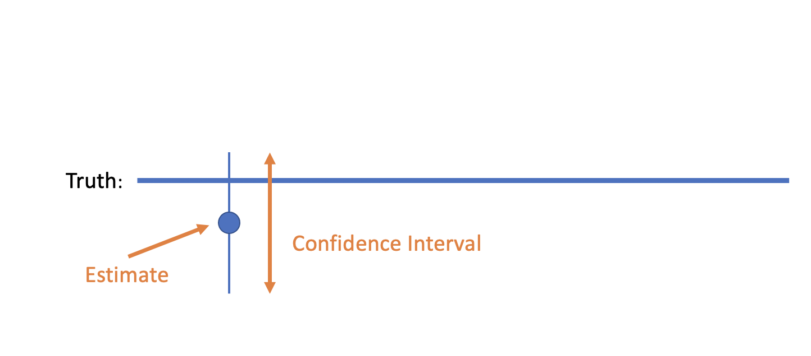

 

## Confidence Intervals 
The particular range of values that we get depends on the sample data, and will change if we go collect a second sample  ...

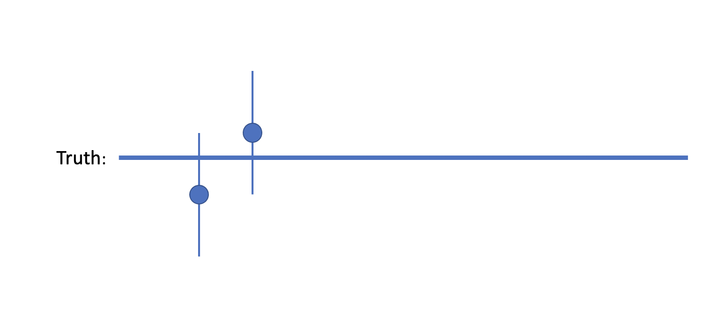 

 

## Confidence Intervals 
 ... or a third sample  ...

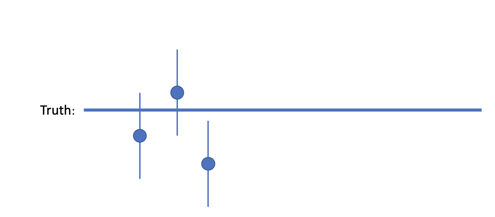

 

## Confidence Intervals 
Over (hypothetical) **repeated sampling , 95 % **of these intervals  will cover the truth.

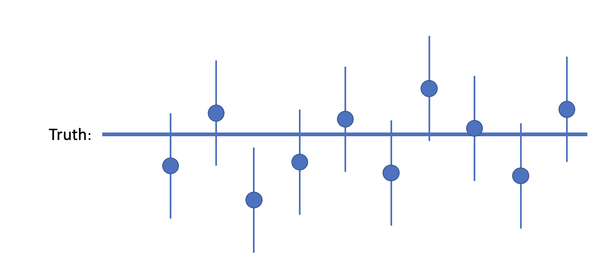

 

## Confidence Intervals 

  
 
  

  

<span style="color:blue">Important:  it is not **our interval**  that contains the truth 95 % of the time. Our interval either contains the truth, or it doesn't (as the image above shows). It is the **procedure**  of computing confidence intervals over **repeated sampling**  that gives us 95 % coverage of the truth.

 

## Interpreting Confidence Intervals: Example 
95 % CI for mean birthweight in grams is: (3413.6, 3414.5)

  

Which of these is the correct interpretation?

  

\begin{enumerate 
-  95 % of children have birthweights between 3413.6 and 3414.5 grams.
-  Our observed sample mean of 3414 grams would not be considered unusual if the true population mean birthweight were between 3413.6 and 3414.5 grams.
-  There is a 95 % chance that the true population mean birthweight is between 3413.6 and 3414.5 grams.
  
 

## Interpreting Confidence Intervals: Example 
95 % CI for mean birthweight in grams is: (3413.6, 3414.5)

  

Which of these is the correct interpretation?

  

\begin{enumerate 
-  95 % of children have birthweights between 3413.6 and 3414.5 grams.
-  <span style="color:blue">Our</span> observed sample mean of 3414 grams would not be considered unusual if the true population mean birthweight were between 3413.6 and 3414.5 grams. 
-  There is a 95 % chance that the true population mean birthweight is between 3413.6 and 3414.5 grams.*
  

 *this* is a common mistake, and is *not*  the correct interpretation of a confidence interval!

 

## Interpreting Confidence Intervals: How-to 
Confidence intervals should always be interpreted **in context** .

  

When interpreting confidence intervals, it may be useful to have a "word formula" to refer back to. An example of this is:

  

Our observed sample estimate  of \_\_\_ <span units  would not be considered unusual if the true population  were between \_\_\_ and \_\_\_  .

 

## Interpreting Confidence Intervals: How-to 
Confidence intervals should always be interpreted *in context .

  

When interpreting confidence intervals, it may be useful to have a "word formula" to refer back to. An example of this is:

  

Our observed sample estimate  of \_\_\_ units  would not be considered unusual if the true population parameter  were between \_\_\_ and \_\_\_ units .

  

Replacing the words and filling in the blanks for our example, we get:

  

Our observed sample mean  of 3414 grams  would not be considered unusual if the true population mean birthweight  were between 3413.6 and 3414.5 .

 

## Statistical Inference: New Example 


1.  **Scientific question**:  do birth parents in King County who participated in First Steps (FS) have <span style="color:orange">different </span> <span style="color:blue">birth outcomes</span> ?
  

 

## Statistical Inference: New Example 


1.  **Scientific question**:  do birth parents in King County who participated in First Steps (FS) have <span style="color:orange">different </span><span style="color:blue">birth outcomes</span> ?
2.  **Statistical question**:  is there a <span style="color:orange">difference in average</span>  <span style="color:blue">birthweight</span>  between birth parents in FS and those not in the program?
  

 

## Statistical Inference: New Example 
 
1.  **Scientific question**:  do birth parents in King County who participated in First Steps (FS) have <span style="color:orange">different </span><span style="color:blue">birth outcomes</span> ?
2.  **Statistical question**:  is there a <span style="color:orange">difference in average</span>  <span style="color:blue">birthweight</span>  between birth parents in FS and those not in the program?
3.  **Population**  = all babies born in King County, **parameter**  = difference in population means (between babies born to parents in FS vs. not)
  
  

 

## Statistical Inference: New Example 

1.  **Scientific question**:  do birth parents in King County who participated in First Steps (FS) have <span style="color:orange">different </span><span style="color:blue">birth outcomes</span> ?
2.  **Statistical question**:  is there a <span style="color:orange">difference in average</span>  <span style="color:blue">birthweight</span>  between birth parents in FS and those not in the program?
3.  **Population**  = all babies born in King County, **parameter**  = difference in population means (between babies born to parents in FS vs. not)
4. Take a **sample**  from the population: 2500 singleton births in King County in 2001
  

 

## Statistical Inference: New Example 

1.  **Scientific question**:  do birth parents in King County who participated in First Steps (FS) have <span style="color:orange">different </span><span style="color:blue">birth outcomes</span> ?
2.  **Statistical question**:  is there a <span style="color:orange">difference in average</span>  <span style="color:blue">birthweight</span>  between birth parents in FS and those not in the program?
3.  **Population**  = all babies born in King County, **parameter**  = difference in population means (between babies born to parents in FS vs. not)
4. Take a **sample**  from the population: 2500 singleton births in King County in 2001
5.  Perform **statistical inference** :
  
    i.  Calculate the corresponding **statistic**  (difference in sample means between FS vs. not)
    ii.  Quantify the uncertainty in our statistic
    iii.  Perform a hypothesis test
  
  

 

## Statistical Inference: New Example 

1.  **Scientific question**:  do birth parents in King County who participated in First Steps (FS) have <span style="color:orange">different </span><span style="color:blue">birth outcomes</span> ?
2.  **Statistical question**:  is there a <span style="color:orange">difference in average</span>  <span style="color:blue">birthweight</span>  between birth parents in FS and those not in the program?
3.  **Population**  = all babies born in King County, **parameter**  = difference in population means (between babies born to parents in FS vs. not)
4. Take a **sample**  from the population: 2500 singleton births in King County in 2001
5.  Perform **statistical inference** :
  
    i.  Calculate the corresponding **statistic**  (difference in sample means between FS vs. not)
    ii.  Quantify the uncertainty in our statistic
    iii.  Perform a hypothesis test
  
6. Make conclusions in context of original questions
  

 

## Statistical Inference: New Example 
To perform statistical inference, we need:

  

A **statistic** : difference in average birthweight **in our sample**  between babies born to parents in FS vs. not in FS 

  

**Uncertainty**  in our statistic: 95 % confidence interval for difference in average birthweight

  

To perform a **hypothesis test**: 

 
-  **Null and alternative hypotheses** :
  
    -  $H_0$: $\mu_{\text{FS}} - \mu_{\text{no FS}}   = 0$
    -  $H_1$: $\mu_{\text{FS}} - \mu_{\text{no FS}}   \neq 0$
  
-  **Choice of test** : two-sample t-test (unequal variance)
  
    -  Test if the averages in two independent groups are equal
    -  We will not assume variance in birthweight is the same in babies born to parents in FS vs. not in FS
  
 
 

## Statistical Inference: New Example 

We can conduct a two-sample t-test to answer this question in \texttt{R} :

  

  
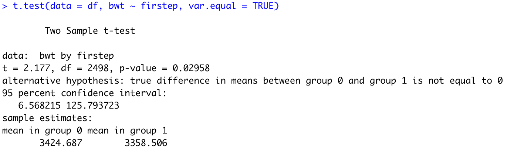
  

 

## Statistical Inference: New Example 
  
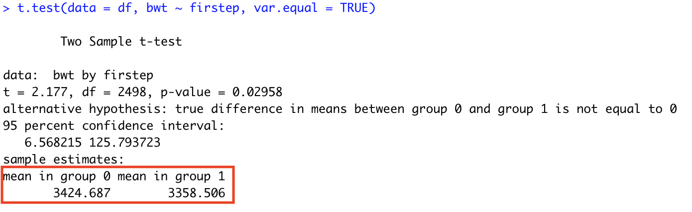
  

 
-  The observed difference in means is $3424.687-  3358.506 \approx 66$ grams, with group $0$ having the higher mean
 


 

## Statistical Inference: New Example 
  
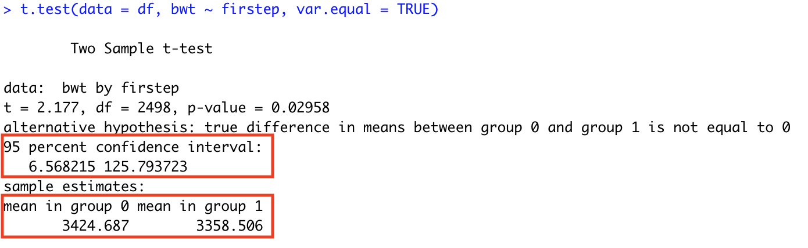
  

 
-  The observed difference in means is $3424.687-  3358.506 \approx 66$ grams, with group $0$ having the higher mean
-  The 95 % confidence interval for the difference in means is $(6.57, 125.79)$
 

 

## Statistical Inference: New Example 
  
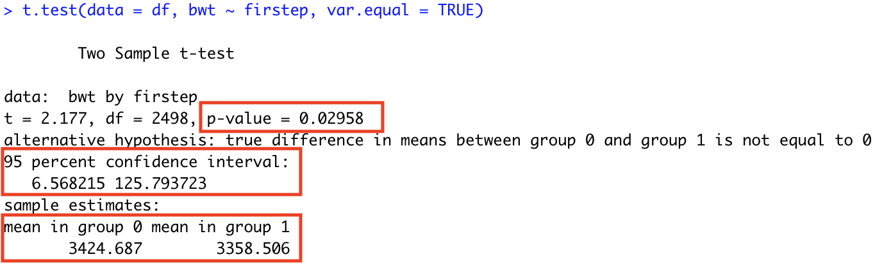
  

 
-  The observed difference in means is $3424.687-  3358.506 \approx 66$ grams, with group $0$ having the higher mean
-  The 95 % confidence interval for the difference in means is $(6.57, 125.79)$
-  The p-value corresponding to this test is $0.03$
 

 


## Interpreting p-values 
**Definition:  a *p-value  is the probability of obtaining a test statistic *as or more extreme  than the observed test statistic (computed from your data) under the null hypothesis

 
- [] \textcolor{red {Not  the probability that the alternative hypothesis is true! 
 

   

(A less official definition): a *p-value  is a number between 0 and 1 that quantifies the statistical strength of your evidence against the null hypothesis

  

Values closer to 0 correspond to stronger evidence
 
-  Reject $H_0$ if p-value ($p$) is smaller than some pre-specified threshold $\alpha$ (usually 0.05)
-  If $p < \alpha$ we declare"statistical significance" and reject $H_0$
- <span style="color:red">We never accept the null hypothesis</span>:  our options are to "reject $H_0$" or "fail to reject $H_0$"
 

 

## Statistical Inference: New Example 
Interpreting our results:

  

 
-  *Statistic:  We estimate that the difference in mean birthweight between babies born to birth parents in FS vs. those not in FS is 66 grams (with those not in FS having higher mean birthweight).
 

 

## Statistical Inference: New Example 
Interpreting our results:

  

 
-  *Statistic:  We estimate that the difference in mean birthweight between babies born to birth parents in FS vs. those not in FS is 66 grams (with those not in FS having higher mean birthweight).
-  *Uncertainty:  Based on a 95 % confidence interval, this observed difference would not be surprising if the true difference were between 6.57 and 125.79 grams.
 

 

## Statistical Inference: New Example 
Interpreting our results:

  

 
-  *Statistic:  We estimate that the difference in mean birthweight between babies born to birth parents in FS vs. those not in FS is 66 grams (with those not in FS having higher mean birthweight).
-  *Uncertainty:  Based on a 95 % confidence interval, this observed difference would not be surprising if the true difference were between 6.57 and 125.79 grams.
-  *Hypothesis test p-value:  These data provide statistically significant evidence that the difference in mean birthweight between groups is different from zero ($p < 0.05$).
 

 

## Statistical Inference: New Example 
Interpreting our results:

  

 
-  *Statistic:  We estimate that the difference in mean birthweight between babies born to birth parents in FS vs. those not in FS is 66 grams (with those not in FS having higher mean birthweight).
-  *Uncertainty:  Based on a 95 % confidence interval, this observed difference would not be surprising if the true difference were between 6.57 and 125.79 grams.
-  *Hypothesis test p-value:  These data provide statistically significant evidence that the difference in mean birthweight between groups is different from zero ($p < 0.05$).
-  *Conclusion:  These data provide statistically significant evidence to suggest that First Steps participation is associated with birthweight in children.
 

 

## Statistical Inference: New Example 
Interpreting our results:

  

 
-  *Statistic:  We estimate that the difference in mean birthweight between babies born to birth parents in FS vs. those not in FS is 66 grams (with those not in FS having higher mean birthweight).
-  *Uncertainty:  Based on a 95 % confidence interval, this observed difference would not be surprising if the true difference were between 6.57 and 125.79 grams.
-  *Hypothesis test p-value:  These data provide statistically significant evidence that the difference in mean birthweight between groups is different from zero ($p < 0.05$).
-  *Conclusion:  These data provide statistically significant evidence to suggest that First Steps participation is associated with birthweight in children.
 

  

<span style="color:blue">Always give 4 numbers:  point estimate, confidence interval (lower, upper), p-value (even when not significant!)

 

 ## 
 
<font size = 20> Any Questions? </font>
 

