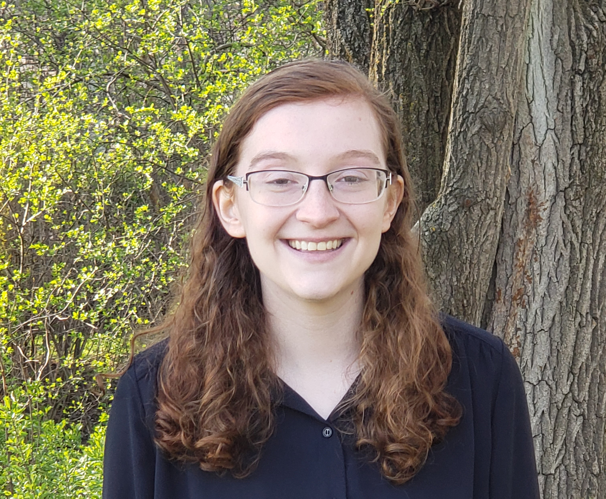

```{r setup, include=FALSE}
knitr::opts_chunk$set(echo = FALSE)
knitr::opts_chunk$set(include = FALSE)
library(knitr)

setwd("~/GitHub/BIOST311_2023/Lectures/Intro")
```

## Outline

- Syllabus and Logistics

- What to Expect

- Course Motivation

# Syllabus

## Land Acknowledgement

(adapted from UW SPH and UWRA) Washington State is home to 29 federally recognized and five unrecognized tribes. We at the University of Washington live and work on the unceded land of the Coast Salish people, the land which touches the shared waters of all tribes and bands within the Duwamish, Suquamish, Tulalip and Muckleshoot nations. 

## Instructor

<p align="center">
{width=20%}
</p>

Nina Galanter (she/her)
galanter@uw.edu

4th year Ph.D. Student in Biostatistics

Statistical interests: Causal inference, survival analysis, applications to Mental and Behavioral Health

## Course Description

"Introduction to regression methods for analysis of continuous, binary, and time-to-event (survival) data. Covers linear regression, logistic regression, and proportional hazards regression, all at an introductory level. Makes use of examples drawn from the biomedical and health sciences literature." 

- Graded, 4 credits
- Course website: canvas.uw.edu
- No textbooks


## Logistics

Lecture: MWF, 12:30 - 1:20pm HSE 214

Discussion: Tuesday, 10:30 - 11:20am HST 359

Office hours: TBD (fill out the when2meet poll!)*


*Office hours also available by appointment


## Learning objectives

In the context of medical and health sciences:

- Interpret numerical and graphical summaries of data 

- Interpret coefficients in linear, logistic, and proportional hazards regression models 
	
- Select an appropriate regression model based on a scientific question and study design

- Describe the necessary assumptions for linear, logistic, and proportional hazards regression in the contexts of estimation and prediction

- Develop and interpret confidence intervals for model parameters


## Learning objectives

- Set up and carry out appropriate hypothesis tests 


- Use linear and logistic regression models to make predictions
	
- Use diagnostic procedures and sensitivity analyses to investigate potential deviations from model assumptions
	
- Use the statistical software R to:
    - Calculate summary statistics and create appropriate graphical displays
    - Perform basic statistical inference procedures
    - Fit linear, logistic, and proportional hazards regression models


## Class communication

- Please sign up to recieve email notifications of canvas announcements and messages.

- Us the canvas discussion board for course context or homework questions

    - I will monitor the board regularly and strongly encourage you to answer others' questions

    - You may email me a question and I will post it anonymously

## Class communication

- Personal concerns or logistics questions can be communicated with me via email

- Please communicate respectfully to your classmates and to me, and let me know if there are ways classroom communication can be made more accessible to you

- I will respond to all emails sent between Monday morning and Friday at 5pm within 24 hours (and all weekend emails by the end of the next Monday)

## Grading

- You can see in the syllabus what you need to complete to get at least a certain grade (it is unlikely but I reserve the right to revise grades upward)

- Grades based on pollev participation, discussion section activities, weekly quizes, homeworks, and course project

- You will have the opportunity to revise homeworks and quizzes to gain credit

- You will turn in a draft project graded on the same rubric as the final project


## Homework

- Posted on canvas one week prior to due date

- Due Thursdays at 11:59 pm

- Completed in a knit markdown pdf (we will go over this)

- You are 
welcome to work together on homework; however, your submitted assignment 
(including R code) should be in your own words. 

- Homework guide and template available on canvas

- Marked complete if you get 80% of the points correct on a given assignment. 

- Solution keys and individual feedback 
will be provided. 


## Homework: Late policy

- You have 3 homework extension days

- You can divide them in any way (e.g. three for one assignment, one for three separate assignments)

- You do not need to let me know in advance, but I would appreciate it 

- If your circumstances call for additional extensions talk to me

- Late homework receives no credit


## Homework Revisions

- After homework is graded, you will have a week to submit revisions to gain a complete homework 

-  To revise an incorrect answer, submit a couple sentences to a paragraph explaining your original reasoning/approach, why it was incorrect, and how to correct it in order to get the correct answer.
 

## Quizzes

- Weekly, open-note Canvas quizzes on Mondays. 

- Designed to ensure that you keep up with course material and can recall material from previous weeks. 

- Each quiz 10 questions: 3 on information from previous weeks, and 7 on the most recent week

- Marked complete if 9 of 10 questions are correct.

- Available from 12:01am PDT Monday until 11:59pm PDT Monday. 

## Quiz Revisions

- Quizzes will be graded on Tuesday, and you will have 48 hours from Wednesday 12:00am PDT to Thursday 11:59pm PDT for revisions

- To revise an incorrect answer, submit a couple sentences to a paragraph explaining your original reasoning/approach, why it was incorrect, and how to correct it in order to get the correct answer


## Discussion section

- Discussion sections will be: group activities, review of class material, discussion of group projects, and practice using R. 

- Required to hand in a brief exercise (credit/no credit) at each discussion section 

- In person only

    - If you are unable to attend in person, you have the opportunity to complete the activity within a week to gain credit

    - If you anticipate not being able to be there in person for many of the sections please let me know
 
## Pollev Questions

- There will be poll everywhere questions during every lecture

- To get credit answer all questions correctly

- You will have time to correct your answers in class

- Or you can answer before the next class to get credit, using the zoom recording

## Pollev

To get credit for the pollev questions for today's lecture, just make sure you can access pollev by answering one question at pollev.com/ninag

## Final Project

- There will be a final data analysis project

- Will be completed individually

- You will select a dataset, develop an appropriate analysis plan, carry out the analysis, and write a short report

- A guidelines document is on canvas
 
## Final Presentation

- You will give a 10 minute slide presentation on your project to the class on May 31 or June 2. 

- If you are unable to make one or both of these classes please let me know as soon as possible.


## Course Policies - Computing

- You will be expected to have access to a laptop during discussion sections, but not generally during lecture

    - Computing in R is an important component of this course. 
    - You may borrow a computer for either short- or long-term use from the Student Technology Loan Program (stlp.uw.edu)
    - Please see me if this expectation will cause trouble for you, and I can work out a solution.
 
 
## Course policies - Academic Honesty
	
- Students are encouraged to familiarize themselves with the academic honesty policies. 
	
- If you hand in homework or a quiz not written in your own words, all students involved will get a 0 without the opportunity to regain credit
 
- Students should not discuss course projects with each other except during designated discussion sections and peer review

## Course policies - Illness
 
 
- Do not come to class if you have cold/flu/covid symptoms and follow COVID isolation policies

- See the syllabus for other recommendations


## Concerns

- Please feel free to come to me with concerns about the class or myself

- See syllabus for an anonymous feedback form

- If you are not comfortable contacting me you may contact the Department of Biostatistics Associate Director of Academic Affairs (biostgp@uw.edu)

- If you still are not satisfied with the response, you may contact the Department of Biostatistics Chair (bchair@uw.edu)

- You may also contact the Graduate School at G-1 Communications Building, by phone at 206-543-5139 or by email at raan@uw.edu.

## Access and accommodation

- Accessibility is important to me

- If you have established accomodations via DRS, please activite them so we can discuss implementation 

- If you have not yet established services through DRS but have a temporary health condition or permanent disability required accomodations (e.g. mental health, attention related, learning, vision, hearing, physical or health impacts) contact DRS at disability.uw.edu
 
- If you are in the process of setting up accomodations also feel free to reach out to see if I can make the course more accessible in the meantime

## Religious Accommodation

- UW has a religious accomodations policy, see syllabus for details

- Accommodations must be requested within the first two weeks of the quarter

- If anyone is currently observing Ramadan happy to discuss accommodations around that

## Inclusion and Diversity

<font size = 5>

Diverse backgrounds, embodiments and experiences are essential to the critical thinking endeavor at the heart of University education. In SPH, we are expected: 

To respect individual differences, which may include, but are not limited to, age, cultural background, disability, ethnicity, family status, gender, immigration status, national origin, race, religion, sex, sexual orientation, socioeconomic status and veteran status. 

To engage respectfully in the discussion of diverse worldviews and ideologies embedded in course readings, presentations and artifacts, including those course materials that are at odds with personal beliefs and values. 

To encourage students with concerns about classroom climate to talk to their instructor, adviser, a member of the departmental or SPH EDI Committee, the Assistant Dean for EDI, or the program’s director. 
 
</font> 

## Pronouns

- We share our pronouns because we strive to cultivate an inclusive environment where people of all genders feel safe and respected

- We cannot assume we know someone’s gender just by looking at them

- So, I invite everyone to share their pronouns

## Bias and Sexual Harrassment Concerns

- See the syllabus for resources for reporting bias incidents and/or sexual harrassment

- I am also available to discuss concerns with and/or direct you to resources


# What to Expect

## What to Expect: Mathematics

You will need light algebra and mathematical reasoning
 
- No calculus assumed
	
- We won't prove technical results, but can provide resources if asked
	
- Quizzes will not require any math beyond basic arithmetic, and are open note
 

## What to Expect - Statistics

- This course is the natural sequel to BIOST 310 


- We will learn how to build regression models, estimate parameters, and interpret coefficients 

- Examples will be primarily in public health or health sciences applications

 
## What to Expect: Computing

We will learn basic statistical computing in R


You are **not** expected to have a computing background

- We will demonstrate important functions in lectures and discussion sections
	
- We will provide helpful resources: templates for homework assignments, R code "cheat sheets" with useful functions, etc. 
 
## Homework


**Homework for tonight:** download `R` and `R Studio` (see instructions on Canvas - Week 1 module - Installing R and R Studio link)

Please complete the Background Canvas Quiz 1 by Wednesday! 

- We'll do a mid-quarter Stop/Start/Continue check-in as well!


## 

<font size = 20> Any Questions? </font>
 
# Motivation

## Motivation

Why is statistics important?
 
- We have a research question we want to answer
	
- We hear a claim we think is false, and want to refute it
	
- We have a *lot* of information and we don't know how to make sense of it
	
- We understand the current state of things, but want to predict future outcomes
 

## Example: Research question

Retinol (a Vitamin A derivative) is a popular skin care agent that has been shown in studies to decrease wrinkle surface area and hyperpigmentation. However, retinol is not safe to use for pregant individuals, and additionally retinol has known side-effects of causing skin dryness and stinging for many people. Bakuchiol has been proposed as a retinol alternative that is safe for pregnant individuals to use and does not have similar negative side-effects. However, we are not sure if Bakuchiol is **as effective** as retinol for decreasing wrinkle surface area and hyperpigmentation. 

Q: **Is Bakuchiol** as effective as retinol for improving wrinkle surface area and hyperpigmentation?


How do we answer this question? (one option: [a randomized trial](https://onlinelibrary.wiley.com/doi/10.1111/bjd.16918) )

 

## Retinol Example Continued

 
- Randomly assign 44 individuals to either use Bakuchiol or Retinol over the course of 12 weeks, surveying individuals and taking images every 4 weeks 
- Use image analysis to determine fine wrinkle surface area at each time point


<p align="center">
 
 
 
 </p>


 

## Retinol Example Continued

Why is statistics important?


In this example:
 
- Allows us to determine whether or not there is a difference in outcomes based on exposure (retinol vs. Bakuchiol) that is due to **the exposure alone** (i.e. no other variable could have mattered)
- A standardized way of measuring the outcome. This study didn't compare qualitatively if they thought individuals had a lower wrinkle surface area, they used image analysis!
- Allows us to determine if there is a **statistically significant** difference in outcomes between Bakuchiol and retinol users (we'll come back to this throughout the course)
 

 

## Example: Refuting a false claim

<p align="center">

{width=85%}

</p>


## Example: Refuting a false claim

A paper published in the Lacet (a relatively high-impact journal!) in 1998 suggested that the measles, mumps, and rubella (MMR) vaccine may cause autism spectrum disorder in children.

<p align="center">


</p>
 

## Example: Refuting a false claim

Statistical tools used to critically assess (and eventually refute) this claim:
 
- The sample size in their study was $n = 12$ (which is *very* small)
- Their study design was uncontrolled, so causal claims could not be made 
 
## Example: Refuting a false claim

Why is statistics important?
 
- Allows us to critically assess scientific claims
- Understanding the assumptions underlying statistical methods and study designs lets us think **scientifically and statistically** about whether or not these assumptions are met
 

An important aside with this study: the lead author was funded by lawyers who had been representing parents in lawsuits against vaccine-producing companies. Critically reading studies from *many* angles (not only statistical) is important! A more detailed summary of this article and follow-up can be found [here](https://www.ncbi.nlm.nih.gov/pmc/articles/PMC3136032/).

 

## Example: Making sense of data

 
- Cholera outbreak in 1854 in London
- People were unsure where it was coming from (airborne? spread through food? from animals?)
- Informational available: where cholera patients lived
- A doctor, John Snow, decided to make a map...

## Example: Making sense of data

<p align="center">
{width=85%}
</p>
 
## Example: Making sense of data


 - Mapping the cholera cases was the key to realizing the disease was spread through water, specifically the Broad Street pump
- An example of descriptive spatial statistics
 

Why is statistics important?
 
- Allows us to distinguish patterns in data that were previously unclear
- With this specific example, more advanced statistical methods could be used to detect clusters of points in space
 
## Example: Prediction
 
<p align="center">
{width=85%}
</p>
 
## Example: Prediction
 
<p align="center">
{width=85%}
</p>

## Example: Prediction
 
<p align="center">
{width=85%}
</p>

## Example: Prediction
 
<p align="center">
{width=85%}
</p>

## Example: Prediction
 
<p align="center">
{width=85%}
</p>

## Example: Prediction
 
<p align="center">
{width=85%}
</p>

## Example: Prediction
 
<p align="center">
{width=85%}
</p>


 
## Example: Prediction

- Statistics influences public policy and our daily lives
- Care needs to be taken when developing prediction models
	 
    - Which covariates may be important predictors of the outcome?
    - Which covariates are extraneous and don't need to be included?
    - Are any of the covariates we include *problematic*, or may lead to conclusions that are socially unjust?
    - What social/political context should we consider when making the model?
	 
- Uncertainty needs to be appropriately calculated *and* reported
 
 

## Key Takeaway

Regression (the main focus of our course) is a statistical tool underlying *many* statistical problems, including some of the ones we just discussed!
 

##

<font size = 20> Any Questions? </font>
 
